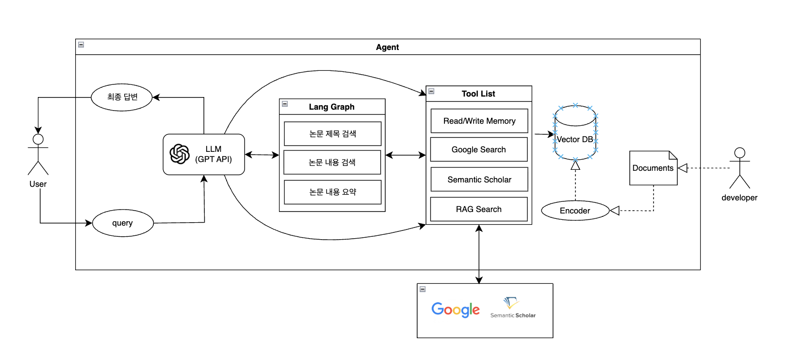

# Transpoter

논문 검색 및 추천을 위한 AI 에이전트 시스템

보고서 파일 : [생성형 AI 응용 Final Project 보고서.docx](https://github.com/user-attachments/files/24160066/AI.Final.Project.docx)  
발표자료 : [생성형 AI 응용 발표자료.pdf](https://github.com/user-attachments/files/24168027/AI.pdf)

## 📁 프로젝트 구조

```
transpoter/
│
├── graph/                     # LangGraph 기반 에이전트 구조
│   ├── graph.py               # 메인 그래프 정의 및 노드 연결
│   ├── state.py               # AgentState 정의 (메시지 관리, 상태 추적)
│   ├── nodes.py               # 핵심 노드 (agent_node, tools_node)
│   ├── runner.py              # 그래프 실행 및 스트리밍 처리
│   └── subgraphs/             # 기능별 서브 그래프
│       ├── paper_search.py    # 논문 검색 (RAG → API → Google)
│       ├── paper_analysis.py  # 논문 분석 (RAG → API → 사용자 확인)
│       └── recommendation.py  # 논문 추천 (관심사 기반)
│
├── tools/                     # Tool 정의 및 관리
│   ├── tool_definitions.py    # OpenAI Function Calling 형식 Tool 정의
│   ├── tool_registry.py       # Tool 등록 및 실행 관리
│   ├── chroma_client.py       # ChromaDB 벡터 검색 클라이언트
│   └── reranker.py            # Cohere Reranker API 통합
│
├── prompts/                   # 프롬프트 템플릿
│   ├── system_prompt.py       # 에이전트 시스템 프롬프트
│   └── memory_extractor_prompt.py  # 메모리 추출 프롬프트
│
├── memory/                    # 메모리 시스템
│   └── reflection.py          # 대화 기록 기반 메모리 추출
│
├── data/                      # PDF 논문 파일 저장소 (인덱싱 대상)
├── chroma_db/                 # ChromaDB 벡터 DB 저장 경로
├── images/                    # 프로젝트 이미지 자료
│
├── ui.py                      # Gradio 기반 웹 UI + FastAPI 서버
├── ingest.py                  # PDF 임베딩 및 ChromaDB 인덱싱 스크립트
├── main.py                    # 테스트용 CLI 실행 파일
│
├── requirements.txt           # 패키지 의존성
└── README.md                  # 프로젝트 문서
```

## 🔧 주요 파일 설명

### 핵심 구조 (`graph/`)
- **`graph.py`**: LangGraph 기반 에이전트 워크플로우 구성
- **`state.py`**: 에이전트 상태 관리 (최근 50개 메시지 유지)
- **`nodes.py`**: OpenAI API 호출 및 Tool 실행 노드
- **`runner.py`**: 그래프 실행 및 스트리밍 출력 처리

### Tool 시스템 (`tools/`)
- **`tool_definitions.py`**: 논문 검색/분석/추천 Tool 정의
- **`tool_registry.py`**: Tool 등록 및 동적 호출 관리
- **`chroma_client.py`**: 벡터 검색 (RAG)
- **`reranker.py`**: Cohere Reranker로 검색 정확도 향상

### UI 및 실행 파일
- **`ui.py`**: Gradio 웹 인터페이스 (채팅 + 로그 표시)
- **`ingest.py`**: PDF 파일을 ChromaDB에 인덱싱 (벡터 저장)
- **`main.py`**: CLI 테스트용 (실제 사용하지 않음)

## 📦 설치 및 실행

### 1. 환경 설정
```bash
pip install -r requirements.txt
```

### 2. PDF 인덱싱
```bash
python ingest.py
```
`data/` 폴더의 PDF 논문들을 ChromaDB에 저장합니다.

### 3. 웹 UI 실행
```bash
python ui.py
```
브라우저에서 `http://127.0.0.1:8000` 접속

## 🧠 시스템 아키텍처

### 전체 시스템 구조


사용자의 쿼리는 LLM(GPT API)을 통해 처리되며, LangGraph가 논문 검색, 분석, 추천의 세 가지 주요 워크플로우를 관리합니다. 각 워크플로우는 다음 Tool들을 활용합니다:
- **Read/Write Memory**: 대화 기록 저장 및 관리
- **Google Search**: 웹 기반 논문 검색
- **Semantic Scholar**: 학술 논문 API 검색
- **RAG Search**: Vector DB(ChromaDB)를 통한 로컬 논문 검색

개발자가 업로드한 Documents는 Encoder를 통해 임베딩되어 Vector DB에 저장됩니다.

### LangGraph 워크플로우


#### 1. 논문 검색 흐름 (Paper Search)
```
ps_setup → ps_rag → ps_api → ps_google → ps_finish
```
- **ps_rag**: RAG에서 검색, 찾으면 즉시 `ps_finish`로 이동
- **ps_api**: RAG에서 못 찾으면 Semantic Scholar API 검색, 찾으면 `ps_finish`
- **ps_google**: API에서도 못 찾으면 Google Custom Search 실행 후 `ps_finish`

#### 2. 논문 분석 흐름 (Paper Analysis)
```
pa_setup → pa_rag → pa_api → pa_ask_user → pa_finish
```
- **pa_rag**: RAG에서 검색, 찾으면 즉시 `pa_finish`
- **pa_api**: RAG에서 못 찾으면 Semantic Scholar API 검색, 찾으면 `pa_finish`
- **pa_ask_user**: API에서도 못 찾으면 사용자 확인 요청 (Interrupt - Human-in-the-loop)

#### 3. 논문 추천 흐름 (Recommendation)
```
rec_setup → rec_interests → rec_recommend → rec_finish
```
- **rec_interests**: 사용자 관심사 분석
- **rec_recommend**: ChromaDB 기반 유사 논문 추천

## 🛠️ 기술 스택
- **LangGraph**: 에이전트 워크플로우 구성
- **OpenAI GPT-4o-mini**: LLM 모델
- **ChromaDB**: 벡터 DB (RAG)
- **Cohere Reranker**: 검색 정확도 향상
- **Gradio + FastAPI**: 웹 UI
- **Semantic Scholar API**: 논문 검색
- **Google Custom Search**: 웹 검색
